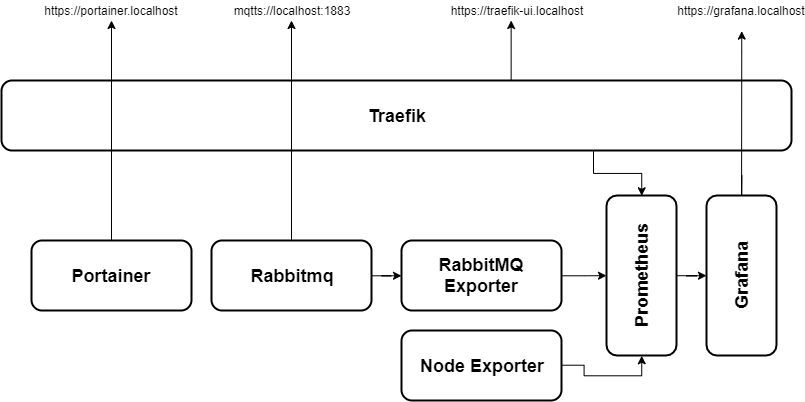

# iot-stack
This is an easily setupable dockerized Iot stack based on RabbitMQ message queue, with monitoring and security features.
This stack will give you a functional rabbitmq with secure mqtt endpoint and grafana metrics.

## How to start / setup
Before start the default passwords/domains can set if you wish.
The default password is password and the domain is localhost.
1. First compose up the Traefik reverse-proxy.
2. (optional) Then start the Portainer if you wish.
3. After, the Prometheus and Rabbitmq can start as well.