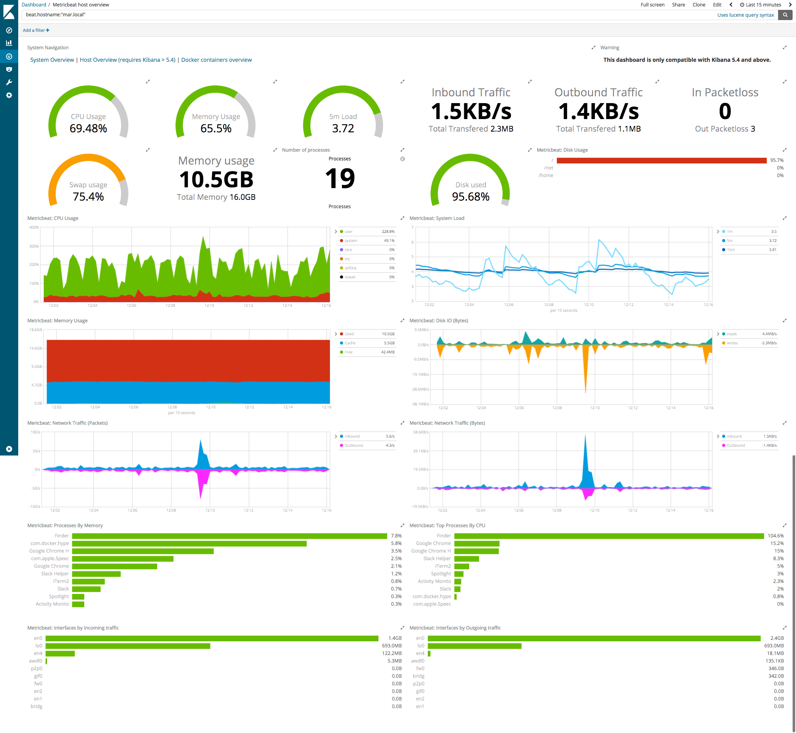

# iot-stack
This is an easy to setup dockerized IOT stack, based on RabbitMQ message queue, with monitoring and security features.
This stack will give you a functional
- Traefik reverse proxy. with LetsEncrypt wildcard certificates.
- RabbitMQ with AMQP, MQTT endpoints
- Elastic (ELK) stack, what by default connected with the RabbitMQ. (You can monitor and create dashboards based on your MQTT messages)
- Grafana + Promethetus stack with metrics from the system, the RabbitMQ and the reverse proxy
- Portainer for better docker experience

_Note: when hosting at localhost, the certificate may be invalid, but hosting on a server with real domain will generate you valid certificates with LetsEncrypt_

## Before start
This stack is based on [Docker technology](https://docs.docker.com/). That means you can start or stop these systems anytime you want, or run it on an other system and the same setup will start.

# Traefik
First compose up the Traefik reverse-proxy.

        docker-compose -f traefik/docker-compose.yaml up -d

This will start an instance of the Traefik. This service will handle the security, and reverse proxy stuff. Now You should be able to check it's status via the ui (authentication is admin/password by default) on https://traefik-ui.localhost

# Portainer
If you wish, You can start the [portainer](https://www.portainer.io/), what is a fancy tool for monitoring your docker services. This is quite optional, but why not eh?

        docker-compose -f portainer/docker-compose.yaml up -d
        
It should be accessable via https://portainer.localhost by default. At the first visit it will ask you to create the default user, so you can set the user/password here.

# Prometheus stack
Prometheus stack is also extremely useful for monitoring. It is not that resource hungry in my opinion, so worth running it. 

        docker-compose -f prometheus/docker-compose.yaml up -d
        
This will start the grafana tool here: https://grafana.localhost The default password is (admin/password).
You should connect Grafana with Prometheus manually like this: .
After succesfull connection you can now install dashboards, or create your own if you wish. You get metrics from the Traefik, RabbitMQ and the host system by default.

After installing some dashboards in grafana you can see things like this:
If you dig yourself a little bit into the prometheus/grafana topic you can easily create fancy dashboards here about your server hardware/mqtt/api usage here.

# RabbitMQ
On of the most important piece in the IOT puzzle is the message broker. We will not use the common Mosquitto broker here, but a more powerful one, the RabbitMQ. By default the RabbitMQ is a AMQP broker, what is a different message protocol than the MQTT, but we can enable the MQTT as well. For start the secure and ready to use mqtt broker, just compose it up like this:

        docker-compose -f rabbitmq/docker-compose.yaml up -d
        
After composing it, the ui (yes it provides a cool broker UI) should be accessable at: https://rabbitmq.localhost (guest/guest) and you should be able to use your mqtt broker at mqtts://localhost:1883 (guest/guest)

___Important note:___ _The rabbitmq is a custom build image, what means, if you change something in the rabbit's config you should build it again!_

# Elastic-Logstash-Kibana (ELK)
If you wish you can start the ELK Stack.

        docker-compose -f elk/docker-compose.yaml up -d

The ELK Stack is the most resource hungry one in this setup. It event takes a few minutes to start. After started, you can take a look at it at https://kibana.localhost with user: elastic password: password

The Logstash service is responsible for transport all the data from rabbitMQ to the elastic. If the ELK service is up, you should see every mqtt message there, in structrured format and you can create dashboards, charts etc. from that data. You can simple create your own IOT monitoring system there.

# Before deploy
For proper usage you might obviously want to change the classic admin/password duo in your authentications and use the services in a server different domain than your localhost. If you already bought a domain it is quite easy to setup.
<!-- |Service|Password location|url location|Note|
|---|---|---|---|
|Traefik|traefik/configuration/traefik.toml|traefik/configuration/traefik.toml|
|RabbitMQ-broker|rabbitmq/environment/rabbitmq/rabbitmq.conf|You can only change the port on the traefik|Do not forget to build the image again!|
|RabbitMQ-ui|rabbitmq/docker-compose.yaml|rabbitmq/docker-compose.yaml|
|Prometheus|prometheus/docker-compose.yaml|prometheus/docker-compose.yaml|
|ELK-Kibana|elk/docker-compose.yaml|elk/docker-compose.yaml|
|Portainer|Will ask when first visited|Portainer/docker-compose.yaml|When restart by any reason, it will ask for password again. That's quite dangerous! TODO| -->

# TODOs
- [x] Implement Elastic stack with Kibana dashboard. That will give you ability to create dashboards from data you sent over rabbitmq (mqtt as well of course). Till I integrate Elastic to this stack, you can use this cool repo: https://github.com/deviantony/docker-elk
- [ ] Make Grafana datasource setup autonomus.
- [x] Setup http->https redirection
- [ ] Make Portainer store password
- [ ] Make password/user change easier
- [ ] Make Domain change easier

# Still questions?
If you have any question, suggestion, you can [email](mallar.david@gmail.com) me, or connect me on [Linkedin](https://www.linkedin.com/in/david-j-mallar)